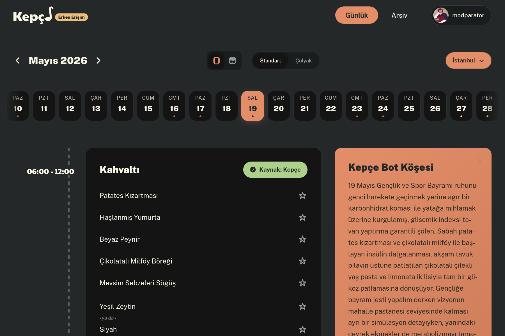
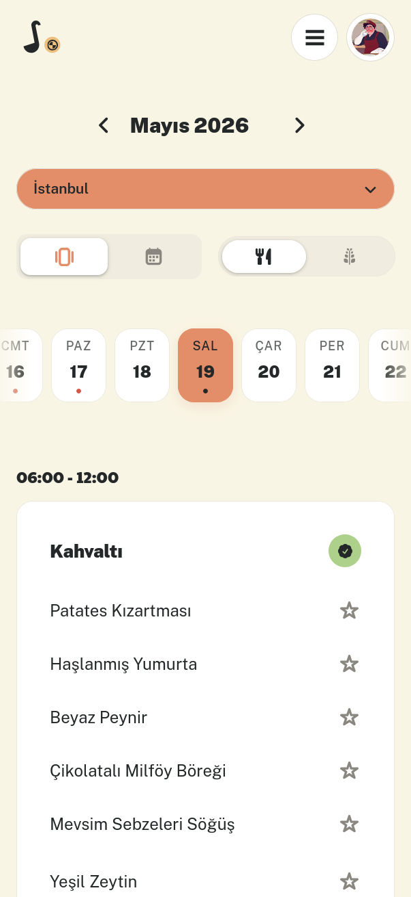

# Kepçe - Önüne Hazır Konanı Yeme Sanatı

Açık kaynaklı, şeffaf ve güvenilir KYK yemekhane veri ağı. Kepçe; dağınık yurt tabela listelerini, Excel tablolarını ve görsel menüleri otomatik toplayan, standartlaştıran ve temiz bir REST API ile öğrencilere sunan bir topluluk projesidir.

## Yasal Sorumluluk Reddi

Kepçe, Gençlik ve Spor Bakanlığı veya Kredi ve Yurtlar Kurumu ile doğrudan veya dolaylı hiçbir kurumsal bağı bulunmayan, kâr amacı gütmeyen, bağımsız bir projedir. Menü, gramaj ve fiyat verileri; kamusal yurt panoları, resmi duyurular ve açık kaynaklardan öğrencileri bilgilendirme ve şeffaflık amacıyla derlenmektedir.

## Öne Çıkan Özellikler

- Geliştiricilerin ve öğrencilerin kendi uygulamalarında kullanabileceği temiz, dokümante edilmiş JSON API desteği
- Kullanıcı mahremiyetine saygılı, reklam veya üçüncü parti izleyici içermeyen minimalist web deneyimi
- Türkiye genelindeki KYK yurtlarının günlük menülerini ve geçmişe dönük yemek arşivini görüntüleme
- (Eğer mevcutsa) Glütensiz beslenen öğrenciler için ayrı menü

## Hızlı Başlangıç (REST API)

Geliştiriciler ve bot/uygulama geliştirenler için doğrudan erişilebilir, açık ve ücretsiz JSON API:

```bash
# İstanbul için bugünün menüsünü getir
curl -s "https://kepce.org/api/v1/menus?city=istanbul&date=today"
```

<details>
<summary>Örnek JSON Yanıtı</summary>

```json
[
  {
    "id": 1042,
    "city_name": "İstanbul",
    "serve_date": "2026-05-01",
    "meal_type": "dinner",
    "source_type": "kepce",
    "status": "approved",
    "items": [
      {
        "order_index": 0,
        "raw_name": "Mercimek Çorbası",
        "is_alternative": false,
        "amount": "200 ml",
        "calories": 140,
        "price": "18.00 ₺",
        "category": "ÇORBA ÇEŞİTLERİ",
        "master_data": {
          "dish_id": 10,
          "name": "Mercimek Çorbası",
          "is_celiac": false,
          "is_vegan": true,
          "is_vegetarian": true,
          "estimated_calories": 140
        }
      },
      {
        "order_index": 1,
        "raw_name": "Tavuk Sote",
        "is_alternative": false,
        "amount": "180 g",
        "calories": 260,
        "price": "45.00 ₺",
        "category": "KEMİKSİZ TAVUK YEMEKLERİ",
        "master_data": {
          "dish_id": 16919,
          "name": "Tavuk Sote",
          "is_celiac": false,
          "is_vegan": false,
          "is_vegetarian": false,
          "estimated_calories": 260
        }
      },
      {
        "order_index": 2,
        "raw_name": "Pirinç Pilavı",
        "is_alternative": false,
        "amount": "150 g",
        "calories": 220,
        "price": "20.00 ₺",
        "category": "PİRİNÇ PİLAVI ÇEŞİTLERİ",
        "master_data": {
          "dish_id": 311,
          "name": "Pirinç Pilavı",
          "is_celiac": false,
          "is_vegan": true,
          "is_vegetarian": true,
          "estimated_calories": 220
        }
      }
    ],
    "comment_count": 12,
    "rating_sum": 48,
    "vote_count": 10
  }
]
```
</details>

Kota sınırları, filtreleme parametreleri ve yetkilendirme detayları için [REST API referansı](docs/API.md)nı inceleyebilirsiniz.

## Ekran Görüntüleri

<div align="center">
<table width="100%">
<tr>
<td align="center" width="76.5%">

</td>
<td align="center" width="23.5%">

</td>
</tr>
</table>
</div>

## Dokümantasyon

- [Sistem Mimarisi ve Veri Akışı](docs/ARCHITECTURE.md)
- [REST API Referansı](docs/API.md)
- [Katkıda Bulunma Rehberi](CONTRIBUTING.md)
- [Güvenlik Politikası](SECURITY.md)
- [Topluluk Kuralları](CODE_OF_CONDUCT.md)

## Kurulum ve Çalıştırma

Gereksinimler: Rust `1.80+` (cargo), Node.js `20+` ve Docker / Podman.  
*Windows ortamında betikleri çalıştırmak için WSL önerilir.*

### 1. Yerel Geliştirme

Sistemi tek komutla yerel olarak başlatmak için `manage.sh` yönetim betiğini kullanabilirsiniz:

```bash
# Örnek ortam değişkenlerini hazırla
cp .env.example .env

# Tüm servisleri yerel makinede ayağa kaldır
./manage.sh start

# Servislerin durumunu gör
./manage.sh status

# Logları canlı takip et
./manage.sh logs api
./manage.sh logs web
./manage.sh logs db

# Durdur
./manage.sh stop
```

### 2. Konteynerli Dağıtım
```bash
# Konteynerleri derle ve arka planda çalıştır
docker compose up -d --build

# Konteyner loglarını takip et
docker compose logs -f
```

## Katkıda Bulunma

Yeni özellikler eklemek, hata bildirmek veya dokümantasyonu geliştirmek isterseniz bir [Issue](https://github.com/koder-cog/kepce/issues) açabilir veya Pull Request gönderebilirsiniz.

## Lisans ve Telif Hakkı

Telif Hakkı (C) 2026 Kepçe Katkıda Bulunanları.

Bu proje **GNU Affero General Public License v3.0** ile lisanslanmıştır. Detaylar için [LICENSE](LICENSE) dosyasına veya [gayriresmi Türkçe çevirisine](LICENSE_TR) bakabilirsiniz.
