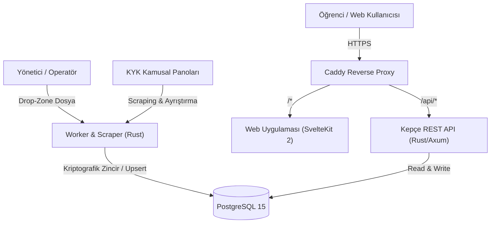

# Kepçe Sistem Mimarisi (Architecture)

Bu belge, Kepçe platformunun servis ayrımını, veri modellerini, güvenlik katmanlarını ve veri akış boru hattını (pipeline) açıklar.

---

## 🏛️ Üst Düzey Mimari (High-Level Overview)

---

## 🧩 Servisler ve Görev Dağılımı

1. **`api` (Rust / Axum):**
   - Yüksek performanslı REST API servisi
   - JWT & Magic Link kimlik doğrulama
   - Şehir bazlı fiyatlandırma motoru (`PeriodPricing`)
   - Oy, yorum, favori ve moderasyon yönetimi
   - Rate limiting, CORS ve PII koruma katmanları

2. **`worker` (Rust):**
   - Excel (`calamine`) ve PDF (`LLM / Vision`) ayrıştırıcıları
   - Kriptografik SHA-256 menü hash chain bütünlük doğrulaması
   - Anomali ve güvenilirlik puanlama motoru
   - Al-götür (takeaway) paket hiyerarşisi ayrıştırma

3. **`webapp` (SvelteKit 2 / Svelte 5):**
   - Saf CSS ve modern tasarım sistemi tokens
   - Şehir seçici, menü zaman çizelgesi, besin & kalori kartları
   - Tamamen responsive (600px mobil, 900px masaüstü kırılımları)
   - SPA geçişleri ve tactile squish geri bildirimleri

4. **`db` (PostgreSQL 15):**
   - Şehirler, menüler, yemekler, kategoriler ve fiyat dönemleri
   - `meal_type_enum` (`breakfast`, `lunch`, `dinner`)
   - `menu_status_enum` (`pending`, `approved`, `rejected`)

---

## 🔒 Güvenlik ve Veri Bütünlüğü Prensipleri

* **Kriptografik Zincir:** Onaylanan her menü bir önceki menünün hash değerini referans alarak SHA-256 hash zincirine eklenir. Geçmişe dönük veri tahrifatı anında tespit edilir.
* **Kaynak Önceliği (Source Priority):** Yönetici (`kepce-admin`: 10) ve kullanıcı (`kepce-kullanici`: 8) onaylı menüleri, harici ham verilerin (`kykyemek`: 4) önüne geçer.
* **Şehir İzolasyonu:** Fiyatlar ve porsiyonlar yalnızca ilgili şehrin (`city.slug`) geçerli fiyat dönemine göre hesaplanır; fiyatı olmayan şehirlere fiyat sızdırılmaz.
