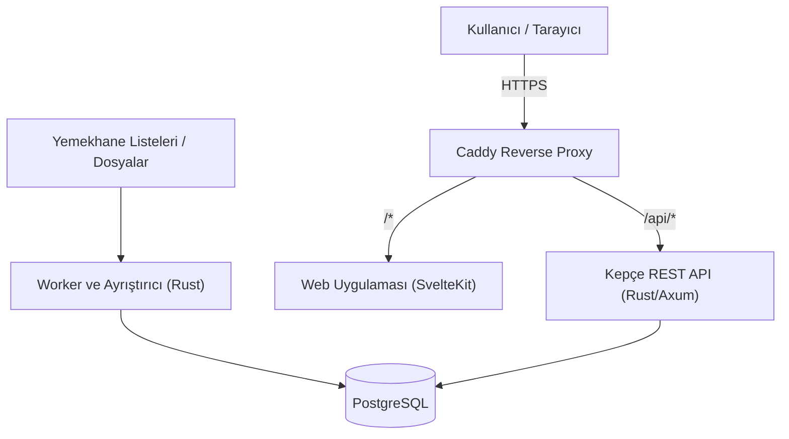

# Kepçe Sistem Mimarisi

Bu belge, Kepçe platformunun ana servislerini, veri akışını ve temel kurallarını özetler.

## Genel Bakış

## Servisler

1. `api` (Rust / Axum):
   - REST API uç noktalarını sunar.
   - Kimlik doğrulama (JWT ve Magic Link), oylama ve yorum işlerini yönetir.
   - Şehre ve tarihe göre resmî fiyat/porsiyon hesaplamalarını yapar.
   - Hız sınırlama (Rate Limiting) ve önbellek başlıklarını yönetir.

2. `worker` (Rust):
   - Excel (`calamine`) tablolarını ve harici panolardan gelen menü verilerini ayrıştırıp veri tabanına işler.
   - Taranmış, yamuk veya bozuk resmî belgelerden yapılandırılmış veri çıkarma.
   - Eksik veya kopya verileri temizler.

3. `webapp` (SvelteKit):
   - Kullanıcıların menüleri incelediği, arama ve filtreleme yaptığı mobil uyumlu web ara yüzü.

4. `db` (PostgreSQL):
   - Şehir, menü, yemek, fiyat tarifesi ve kullanıcı verilerini saklayan ilişkisel veri tabanı.

## Veri Kuralları

- Kaynak Önceliği: Doğrulanmış veya yönetici onaylı menü kayıtları, otomatik taranan ham verilerin önüne geçer.
- Şehir İzolasyonu: Yemek fiyatları ve porsiyonlar yalnızca o şehrin geçerli resmî tarifesi üzerinden hesaplanır; tarifesi olmayan şehirlerde tahmini fiyat gösterilmez.
- Denetim Günlüğü: Onaylanan menülerin değişiklik geçmişi kayıt altında tutulur.
